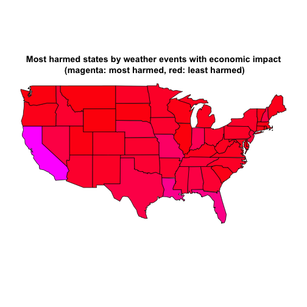
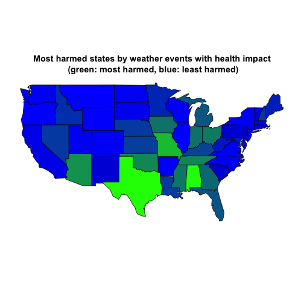

Health and Economic Consequences of Weather Events across United States
By: Mohan Suswaram
=======================================================================


Synopsis
-------------------------------------------------------

Storms and other severe weather events has the potential to cause both public health and economic problems for communities and municipalities. 

This analysis is based on the U.S. National Oceanic and Atmospheric Administration's (NOAA) storm database, in which characteristics of major storms and weather events in the United States are tracked.

Analysis aims at identifying the following across the United States:
1. which types of events have the greatest economic consequences
2. which types of events are most harmful with respect to popuulation health

In order to arrive at the above results, the impact of events should be  calculated across two indicators:
- **totalCost**, the sum of property and crop damages
- **totalHealthCost**, a single number score based on Principal Component Analysis of fatalities and injuries of each event

The calculation of **totalHealthCost** can be based on any linear combination of fatalities and injuries that eventually weighing fatalities differently from injuries. The choice of **PCA-based** calculation warrants the choice of weights to automatic calculations, thus **preserving objectiveness** and reproducibility of results.


Data Processing
-------------------------------------------------------

Data is first extracted from the compressed file **repdata-data-StormData.csv.bz2** which has been placed in the working directory:

```r
rawdata <- read.csv(bzfile("/Users/HariniSuswaram1/RepData_PeerAssessment2/StormData.csv.bz2"))
```


Data is quite huge here:

```r
print(object.size(rawdata), units = "MB")
```

```
## 409.4 Mb
```


Hence data is immediately subsetted selecting only columns relevant to the analysis:

```r
data <- rawdata[, c("STATE", "EVTYPE", "FATALITIES", "INJURIES", "PROPDMG", 
    "PROPDMGEXP", "CROPDMG", "CROPDMGEXP")]
colnames(data) <- tolower(colnames(data))  #column names to lower case
```


Then dataframe is polished to get rid of various formats of values indicating the same measures

```r
data$evtype <- factor(toupper(data$evtype))  #all event types to upper case and refactored
# all exponents defining unit of measurement of costs to upper case and
# refactored
data$propdmgexp <- factor(toupper(data$propdmgexp))
data$cropdmgexp <- factor(toupper(data$cropdmgexp))
```


Looking at the cost exponents, it's clear that not all exponents present in the data have a meaningful value:

```r
levels(data$cropdmgexp)
```

```
## [1] ""  "?" "0" "2" "B" "K" "M"
```

```r
levels(data$propdmgexp)
```

```
##  [1] ""  "-" "?" "+" "0" "1" "2" "3" "4" "5" "6" "7" "8" "B" "H" "K" "M"
```


We therefore define as valid exponents  only the set ("","0","H","K","M","B") and check if, eliminating invalid exponents, we discard too many records:

```r
mean(!(data$cropdmgexp %in% c("", "0", "H", "K", "M", "B")))
```

```
## [1] 8.866e-06
```

```r
mean(!(data$propdmgexp %in% c("", "0", "H", "K", "M", "B")))
```

```
## [1] 0.0001086
```


Quite a few records have a meaningful exponent, so we can continue converting the values of the columns **propdmg** and **cropdmg** to integers defining **cost in dollars units**:

```r
# define multipliers for valid exponents
exponents <- data.frame(c("", "0", "H", "K", "M", "B"), c(1, 1, 10^2, 10^3, 
    10^6, 10^9))
colnames(exponents) <- c("validexp", "multiplier")

# subset data retaining only records with valid exponent
data <- subset(data, (cropdmgexp %in% exponents$validexp) & (propdmgexp %in% 
    exponents$validexp))

# convert damage values in number
colnames(exponents) <- c("validexp", "propdmgmultiplier")
data <- merge(data, exponents, by.x = "propdmgexp", by.y = "validexp")
data$propdmg <- (data$propdmg * data$propdmgmultiplier)

colnames(exponents) <- c("validexp", "cropdmgmultiplier")
data <- merge(data, exponents, by.x = "cropdmgexp", by.y = "validexp")
data$cropdmg <- (data$cropdmg * data$cropdmgmultiplier)
```


Calculation of economic impact of different weather events
----------------------------------------------------------


```r
data$totalCost <- data$propdmg + data$cropdmg  #define total cost
economicData <- subset(data, totalCost > 0)  #select only events with cost > 0

# clean dataframe after subsetting
economicData <- economicData[, c("state", "evtype", "totalCost")]
```


Calculate the sum of total cost groping by state and type of event: 

```r
library(reshape2)
library(plyr)
# sum over states by type of event and arrange for decreasing costs
economicData <- dcast(economicData, state ~ evtype, fun.aggregate = sum, value.var = "totalCost")
economicData <- melt(economicData, id = "state")
economicData <- arrange(economicData, state, desc(value))
```


Per each state, we extract only the event that generated the higher **totalCost**:

```r
# select only event having maximum cost per each state
economicData <- split(economicData, economicData$state)
economicData <- lapply(economicData, function(x) x[1, ])
economicData <- melt(economicData, id = "state", id.vars = "variable", measure.vars = "value")
```


Calculation of health impact
------------------------------

Calculation of the **health impact** is similar to the calculation of economic impact. The only exception is that **totalHealthCost** definition is based on the Principal Component Analysis of fatalities and injuries caused by each event. This choice is based on the opportunity to choose an indicator that ensures *objectvieness* and *reproducibility* of the analysis. The same would not hold true if an arbitrary linear combination of fatalities and injuries were to be chosen.
We therefore calculate principal components of variables fatalities and injuries and check if using a single component of the PCA enable us to retain the majority of the variance of the variables:

```r
# define total health cost through pca
pca <- data[, c("fatalities", "injuries")]
pca <- princomp(pca)
summary(pca)
```

```
## Importance of components:
##                        Comp.1  Comp.2
## Standard deviation     5.4379 0.72389
## Proportion of Variance 0.9826 0.01741
## Cumulative Proportion  0.9826 1.00000
```


98% of the variance is retained with the first component. So we can consider this single number as a *health cost* indicator summarising both fatalities and injuries caused by each event. We can now apply the same calculations we applied for economic impact to our data. We define **totalHealthCost** as the scores given by Component1 of our PCA. We then extract only records having **totalHealthCost** greater than zero:


```r
data$totalHealthCost <- pca$scores[, 1]
healthData <- subset(data, totalHealthCost > 0)  #select only events with cost > 0

# clean dataframe after subsetting
healthData <- healthData[, c("state", "evtype", "totalHealthCost")]
```


Calculate the sum of total health cost groping by state and type of event: 

```r
# sum over states by type of event and arrange for decreasing costs
healthData <- dcast(healthData, state ~ evtype, fun.aggregate = sum, value.var = "totalHealthCost")
healthData <- melt(healthData, id = "state")
healthData <- arrange(healthData, state, desc(value))

# select only max cost event
healthData <- split(healthData, healthData$state)
healthData <- lapply(healthData, function(x) x[1, ])
healthData <- melt(healthData, id = "state", id.vars = "variable", measure.vars = "value")
```


Results
-------------------------------------------------------

Economic impact
------------------------------

Based on the above calculations, for **events that have the greatest economic consequences** we obtain (costs in Bn$):

```r
colnames(economicData) <- c("eventType", "totalCost_Bn", "state")
economicData <- economicData[, c("state", "eventType", "totalCost_Bn")]

# convert in Bn$
economicData$totalCost_Bn <- economicData$totalCost_Bn/10^9
economicData[!is.na(economicData$totalCost_Bn), ]
```

```
##    state                eventType totalCost_Bn
## 1     AK                    FLOOD    1.571e-01
## 2     AL                  TORNADO    6.378e+00
## 3     AM               WATERSPOUT    5.102e-03
## 4     AN MARINE THUNDERSTORM WIND    1.690e-04
## 5     AR                  TORNADO    2.592e+00
## 6     AS                  TSUNAMI    8.102e-02
## 7     AZ                     HAIL    2.829e+00
## 8     CA                    FLOOD    1.174e+02
## 9     CO                     HAIL    1.515e+00
## 10    CT                  TORNADO    5.962e-01
## 11    DC           TROPICAL STORM    1.276e-01
## 12    DE            COASTAL FLOOD    4.015e-02
## 13    FL        HURRICANE/TYPHOON    2.855e+01
## 14    GA                  TORNADO    3.272e+00
## 15    GM         MARINE TSTM WIND    3.226e-03
## 16    GU                  TYPHOON    6.011e-01
## 17    HI              FLASH FLOOD    1.571e-01
## 18    IA                    FLOOD    2.970e+00
## 19    ID                    FLOOD    1.142e-01
## 20    IL              RIVER FLOOD    1.003e+01
## 21    IN                  TORNADO    2.595e+00
## 22    KS                  TORNADO    2.682e+00
## 23    KY                  TORNADO    8.907e-01
## 24    LA              STORM SURGE    3.174e+01
## 26    LE MARINE THUNDERSTORM WIND    2.500e-05
## 28    LM         MARINE TSTM WIND    1.205e-03
## 29    LO         MARINE TSTM WIND    5.000e-05
## 30    LS         MARINE TSTM WIND    4.000e-04
## 31    MA                  TORNADO    7.560e-01
## 32    MD           TROPICAL STORM    5.392e-01
## 33    ME                ICE STORM    3.182e-01
## 34    MH                HIGH SURF    5.000e-03
## 35    MI                  TORNADO    1.073e+00
## 36    MN                  TORNADO    1.917e+00
## 37    MO                  TORNADO    4.823e+00
## 38    MS        HURRICANE/TYPHOON    1.501e+01
## 39    MT                     HAIL    1.291e-01
## 40    NC                HURRICANE    6.405e+00
## 41    ND                    FLOOD    3.990e+00
## 42    NE                  TORNADO    1.746e+00
## 43    NH                ICE STORM    6.493e-02
## 44    NJ                    FLOOD    2.112e+00
## 45    NM         WILD/FOREST FIRE    1.510e+00
## 46    NV                    FLOOD    6.839e-01
## 47    NY              FLASH FLOOD    1.835e+00
## 48    OH                  TORNADO    2.285e+00
## 49    OK                  TORNADO    3.319e+00
## 50    OR                    FLOOD    7.410e-01
## 51    PA                  TORNADO    1.796e+00
## 53    PK         MARINE HIGH WIND    3.100e-05
## 55    PR                HURRICANE    2.275e+00
## 56    PZ       MARINE STRONG WIND    7.600e-05
## 57    RI                    FLOOD    9.286e-02
## 58    SC                  TORNADO    5.368e-01
## 59    SD                  TORNADO    2.319e-01
## 60    SL         MARINE TSTM WIND    1.500e-05
## 62    TN                    FLOOD    4.250e+00
## 63    TX                  DROUGHT    6.722e+00
## 64    UT                    FLOOD    3.319e-01
## 65    VA        HURRICANE/TYPHOON    5.266e-01
## 66    VI                HURRICANE    2.822e-02
## 67    VT                    FLOOD    1.112e+00
## 68    WA                     HAIL    2.199e-01
## 69    WI              FLASH FLOOD    1.188e+00
## 70    WV              FLASH FLOOD    4.865e-01
## 71    WY                     HAIL    1.131e-01
```


Economic costs are bore by each state on a map. To address the skewness  **(totalCost_Bn)^(1/3)** is used:

```r
par(mfrow = c(1, 2))
boxplot(economicData$totalCost_Bn, main = "Distribution of \nTotal Costs in Bn$")
boxplot(economicData$totalCost_Bn^(1/3), main = "Distribution of \n(Total Costs in Bn$)^(1/3)")
```

 


Draw that on a map:

```r
library(maps)

# subset over states wiht defined cost total cost
economicData <- economicData[!is.na(economicData$totalCost_Bn), ]

# get state names and attach them to dataframe
data(state.fips)
tmp <- state.fips
tmp <- data.frame(tmp$abb, tmp$polyname)
colnames(tmp) <- c("state", "stateName")
economicData <- merge(economicData, tmp)

# Use ^(1/3) of costs to adapt for skewness
economicData$totalCost_Bn <- (economicData$totalCost_Bn)^(1/3)

# normalize cost in 0-1 interval
economicData$normCost <- (economicData$totalCost_Bn - min(economicData$totalCost_Bn))/(max(economicData$totalCost_Bn) - 
    min(economicData$totalCost_Bn))

# plot
pal <- colorRamp(c("white", "green"))
map("state", regions = economicData$stateName, lty = 1, lwd = 1, boundary = TRUE, 
    fill = TRUE, col = rgb(pal(economicData$normCost)/255))
title(main = "Most harmed states by weather events with economic impact\n (green: most harmed, white: least harmed)")
```

 


Health impact
-------------------------

For **events with the greatest health consequences** we obtain:

```r
colnames(healthData) <- c("eventType", "totalHealthCost", "state")
healthData <- healthData[, c("state", "eventType", "totalHealthCost")]
healthData[!is.na(healthData$totalHealthCost), ]
```

```
##    state                eventType totalHealthCost
## 1     AK                ICE STORM         33.4125
## 2     AL                  TORNADO       7877.1258
## 3     AM MARINE THUNDERSTORM WIND         21.2689
## 4     AN       MARINE STRONG WIND         17.4015
## 5     AR                  TORNADO       5064.5173
## 6     AS                  TSUNAMI        130.1814
## 7     AZ               DUST STORM        176.8428
## 8     CA                 WILDFIRE        611.4135
## 9     CO                  TORNADO        253.2910
## 10    CT                  TORNADO        699.6226
## 11    DC           EXCESSIVE HEAT        315.6478
## 12    DE                  TORNADO         70.9818
## 13    FL                  TORNADO       3283.4283
## 14    GA                  TORNADO       3867.7126
## 16    GU        HURRICANE/TYPHOON        332.3795
## 17    HI                HIGH SURF         20.4146
## 18    IA                  TORNADO       2175.5368
## 19    ID        THUNDERSTORM WIND         73.4522
## 20    IL                  TORNADO       4099.1294
## 21    IN                  TORNADO       4187.3505
## 22    KS                  TORNADO       2688.0431
## 23    KY                  TORNADO       2774.4141
## 24    LA                  TORNADO       2580.4577
## 28    LM MARINE THUNDERSTORM WIND          0.9347
## 31    MA                  TORNADO       1756.8414
## 32    MD           EXCESSIVE HEAT        461.5193
## 33    ME                LIGHTNING         64.2321
## 34    MH                HIGH SURF          0.8426
## 35    MI                  TORNADO       3340.9094
## 36    MN                  TORNADO       1952.4496
## 37    MO                  TORNADO       4287.0509
## 38    MS                  TORNADO       6191.3236
## 39    MT         WILD/FOREST FIRE         31.5576
## 40    NC                  TORNADO       2501.9325
## 41    ND                  TORNADO        318.3618
## 42    NE                  TORNADO       1136.1336
## 43    NH                LIGHTNING         78.3421
## 44    NJ           EXCESSIVE HEAT        299.5644
## 45    NM                  TORNADO        151.4231
## 46    NV                    FLOOD         49.8827
## 47    NY                  TORNADO        304.1441
## 48    OH                  TORNADO       4407.0040
## 49    OK                  TORNADO       4767.5576
## 50    OR                HIGH WIND         49.1107
## 51    PA                  TORNADO       1221.4486
## 55    PR               HEAVY RAIN          9.6124
## 56    PZ       MARINE STRONG WIND          2.7763
## 57    RI                  TORNADO         22.6628
## 58    SC                  TORNADO       1288.2890
## 59    SD                  TORNADO        439.4989
## 62    TN                  TORNADO       4706.3186
## 63    TX                  TORNADO       8105.6196
## 64    UT             WINTER STORM        411.2769
## 65    VA                  TORNADO        901.2121
## 66    VI                LIGHTNING          0.8887
## 67    VT                TSTM WIND         22.6593
## 68    WA                  TORNADO        302.3291
## 69    WI                  TORNADO       1571.1703
## 70    WV                TSTM WIND        135.0149
## 71    WY             WINTER STORM        117.6506
```


By each state on a map:

```r
library(maps)

# subset over states wiht defined health cost
healthData <- healthData[!is.na(healthData$totalHealthCost), ]


# get state names and attach them to dataframe
data(state.fips)
tmp <- state.fips
tmp <- data.frame(tmp$abb, tmp$polyname)
colnames(tmp) <- c("state", "stateName")
healthData <- merge(healthData, tmp)


# normalize cost in 0-1 interval
healthData$normCost <- (healthData$totalHealthCost - min(healthData$totalHealthCost))/(max(healthData$totalHealthCost) - 
    min(healthData$totalHealthCost))

# plot
pal <- colorRamp(c("white", "red"))
map("state", regions = healthData$stateName, lty = 1, lwd = 1, boundary = TRUE, 
    fill = TRUE, col = rgb(pal(healthData$normCost)/255))
title(main = "Most harmed states by weather events with health impact\n (red: most harmed, white: least harmed)")
```

 

